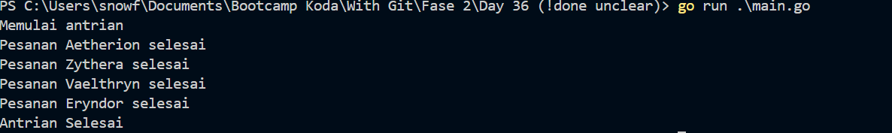

# Go Lang Queue CLI APP
this project is to simulate Queue and practice go routine and WaitGroup

```
var antrian = []Antrian{
	{Nama: "Aetherion", Waktu: 1},
	{Nama: "Zythera", Waktu: 2},
	{Nama: "Vaelthryn", Waktu: 4},
	{Nama: "Eryndor", Waktu: 4},
}
```

from data above this app show one by one and wait as long as duration specified in the struct

## Screenshoot


it's printed one by one

## How to run it
- Download binary queue.exe and run it with terminal on windows
- for other OS build the source code with go compiler